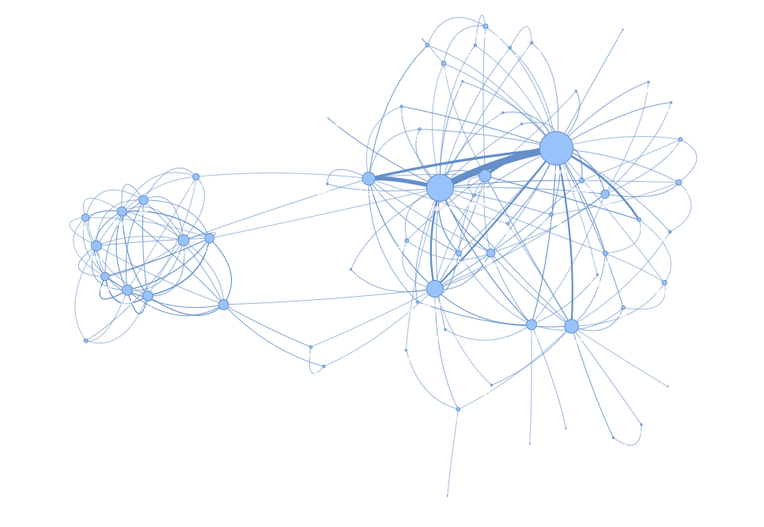

# TV Series NLP Analysis Suite (Naruto Example)

A complete, end-to-end pipeline for collecting, processing, analyzing, and interacting with TV series dialogue using modern NLP and LLM tooling. While the walkthrough uses **Naruto**, the system is fully generalizable to any show with available subtitles/transcripts.

This project was implemented by following [this tutorial on YouTube](https://youtu.be/_Hxb1zoY0Qw). All credit for the original idea and guidance goes to the tutorial author — I rebuilt and extended the project for learning and experimentation.

> **Stack:** Python 3.10.x · Scrapy · spaCy · Hugging Face Transformers · NetworkX · PyVis · Gradio · Llama-family LLMs

---

## 📌 Highlights

- **Data Collection:** Scrape/download subtitles & transcripts with **Scrapy**.  
- **Zero-Shot Theme Tagging:** Extract themes using **Transformers** (no training required).  
- **Character NER + Graph:** Identify characters (spaCy) and build interactive relationship graphs (NetworkX + PyVis).  
- **Custom Classifier:** Fine-tune a text classifier (e.g., sentiment or theme) using **Transformers**.  
- **AI Character Chatbot:** Chat with in-series characters using **Llama** models.  
- **Unified Web UI:** Operate everything from a **Gradio** interface.  

---

## ✅ Requirements

- **Python:** 3.10.x (tested)  
- **OS:** Linux / macOS / Windows  
- **GPU (optional):** Recommended for Transformers + Llama  
- **Dependencies:** See `requirements.txt`  

---

## 📊 Visualizations

### Character Relations

